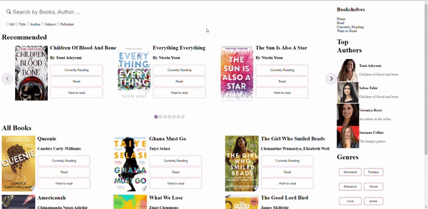

# To set up the project follow the steps below

- Git clone https://github.com/tosimiadesoye/book-library.git
- npm install
- npm start
- to run the app in the development mode.\
Open [http://localhost:3000](http://localhost:3000) to view it in the browser.

